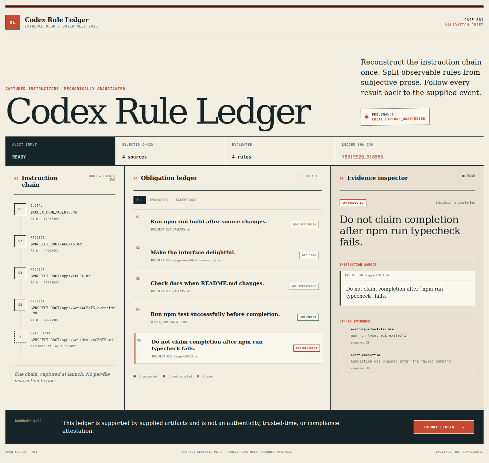

# Codex Rule Ledger

Evidence-bound audits for observable Codex repository instructions.



Codex Rule Ledger reconstructs the instruction chain described by a supplied
Codex launch capture, separates mechanically observable obligations from
subjective prose, and links each result to the supplied session evidence.

It reports evidence. It does **not** certify compliance, authenticate a trace,
or infer that an unlogged action did not happen.

## Why it exists

Repository instructions are layered: global guidance, project guidance, and
directory-specific overrides can all govern one Codex run. Reviewing only the
diff does not show which instructions applied or whether the captured session
contains evidence for the validation it claims.

The v0.1 demo makes that review legible in one screen:

- the reconstructed global-to-launch-directory instruction chain;
- `SUPPORTED`, `CONTRADICTED`, `NOT_EVIDENCED`, and `NOT_APPLICABLE` results;
- declined subjective instructions outside the mechanical result machine;
- exact instruction and event anchors for each result; and
- a deterministic, hash-bound JSON export labeled
  `LOCAL_CAPTURE_UNATTESTED`.

## Try the fixed-fixture demo

Prerequisites: Node.js 24 and npm.

```bash
git clone https://github.com/OrionArchitekton/codex-rule-ledger.git
cd codex-rule-ledger
npm ci
npm run dev
```

Open `http://localhost:3000`. The page is preloaded with the sanitized
`build-week-demo-v1` fixture, so evaluators do not need an API key, private
repository, or rebuild step. Select ledger rows to inspect their evidence, use
the filters to isolate exceptions, and export the canonical ledger JSON.

To run the complete local proof:

```bash
npm run verify
```

The individual checks are `lint`, `typecheck`, `test`, `build`, and
`test:e2e`. The browser acceptance flow starts its own local server.

## What the fixture proves

The disclosed synthetic capture exercises instruction override/fallback order
and the configured byte limit. Its normalized events yield:

| Rule | Result | Required evidence |
|---|---|---|
| Run `npm test` before completion | `SUPPORTED` | An exit-zero command event before completion |
| Do not complete after `npm run typecheck` fails | `CONTRADICTED` | A failed command followed by a completion event |
| Run `npm run build` after source changes | `NOT_EVIDENCED` | The source trigger is present; the required command is absent from the capture |
| Check docs only when `README.md` changes | `NOT_APPLICABLE` | The captured changed-path set affirmatively excludes `README.md` |
| “Make the interface delightful” | `DECLINED_NON_OBSERVABLE` | Subjective prose never receives a mechanical pass/fail result |

`NOT_EVIDENCED` means only that the supplied capture lacks sufficient evidence.
It is never treated as proof of non-action.

## Architecture

One deep module owns the audit boundary:

```ts
runLedgerAudit(bundle, semanticAnalyzer) -> AuditExecution
```

Behind that seam, deterministic TypeScript validates the complete launch
manifest, reconstructs instruction discovery, checks content hashes, evaluates
typed evidence queries, assigns ledger results, redacts absolute paths, and
produces a canonical SHA-256-bound export.

Semantic analysis is replaceable:

- `RecordedFixtureAnalyzer` powers tests and the unrestricted public demo.
- `OpenAIResponsesAnalyzer` uses GPT-5.6 structured output for typed,
  source-linked proposals.

GPT-5.6 cannot emit a ledger verdict, reorder instruction discovery, alter
hashes, or cite an unknown source. Refusal, malformed output, an unallowlisted
fixture digest, or a timeout fails closed. The live adapter has no tools,
  stores no response through the API request, redacts absolute paths and common
  credential-like markers before transmission, has no automatic retry, and
  applies strict input/output bounds.

## Codex and GPT-5.6

Codex was used as the primary engineering agent for product research,
specification, vertical RED-to-GREEN implementation, visual iteration,
adversarial review, and release proof. The repository preserves the living
spec and witnessed build ledger in [`docs/BUILD_LEDGER.md`](docs/BUILD_LEDGER.md).

GPT-5.6 performs the indispensable semantic step: it converts instruction
prose into a closed set of source-linked observable proposals while declining
subjective or ambiguous language. Deterministic code remains the authority for
all final evidence states. The public demo serves a recorded result from the
same typed contract so judging does not consume API budget or expose a key.

## Input, privacy, and trust boundary

v0.1 is deliberately fixture-only and demonstrates Codex 0.144.0 with POSIX
capture paths. It does not accept uploads, URLs, arbitrary
repositories, raw environment dumps, commands, or user-controlled model calls.
The included fixture is synthetic and contains no private code or credentials.

Hashes bind the supplied bytes after capture; they do not establish
authenticity, trusted time, or what a model actually received. Read
[`SECURITY.md`](SECURITY.md) before adapting the analyzer to real traces.

## Project map

- [`specs/codex-rule-ledger-spec.md`](specs/codex-rule-ledger-spec.md) — living
  behavior contract and acceptance criteria.
- [`src/ledger`](src/ledger) — deterministic audit core and analyzer adapters.
- [`fixtures/build-week-demo-v1`](fixtures/build-week-demo-v1) — disclosed
  synthetic capture and recorded semantic proposal batch.
- [`tests`](tests) — deep-seam, adapter, and route contract tests.
- [`e2e/demo.spec.ts`](e2e/demo.spec.ts) — judge-facing browser acceptance flow.
- [`docs/runbooks/public-demo.md`](docs/runbooks/public-demo.md) — rollout,
  validation, monitoring, and rollback.

## Status and license

This is a v0.1 OpenAI Build Week Developer Tools entry and a Personal Authority
`hackathon-project`. Post-event OSS graduation is a separate decision.

MIT licensed. See [`LICENSE`](LICENSE).
